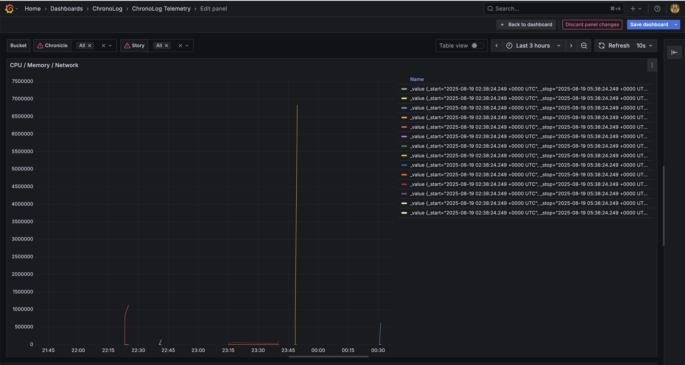
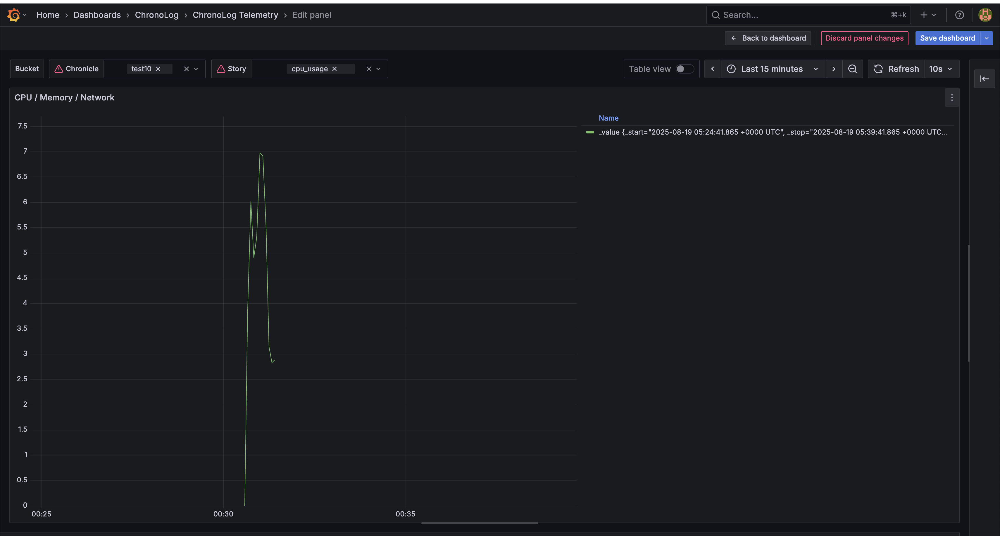

# Streaming Plugin
This folder contains all the development for the streaming plugin API. The goal is to have all the chronolog log events streamed to Grafana for users to have an easy to view and access web interface to see their chronicle,story,event data.

## API v1 - Done
As part of the initial version of the streaming plugin we have a client streaming writer which streams the events to Grafana through InfluxDB. 
- The client_writer writes the hosts stories (CPU, Memory, Network) into ChronoLog
- The client_reader_stream_influx reads these stories from ChronoLog and streams to InfluxDB
- The Grafana dashboard visualizes the metrics in Grafana for the particular Chronicle and Story

### 1. Scripts
#### ClientScripts/client_writer.cpp
- **Purpose:** This is a simple client producer that writes CPU/Memory/Network metrics to chronolog
- **How it works:** It reads real metrics from /proc, acquires/creates three stories (cpu_usage, memory_usage, network_usage), and logs values for every interval_sec

#### ClientScripts/client_reader_stream_influx.cpp
- **Purpose:** This script streams the events from ChronoLog to InfluxDB for Grafana
- **How it works:** It connects to chronolog, ensures the chronicle/stories exist, then on a loop calls the ReplayStory(t_start, t_end) api. The events are converted to line protocol through the transform api created and sent in batches via InfluxDBSink. It also maintains a pe -story cursor to avoid re reading the events

#### StreamingScripts/InfluxDBSink.h and InfluxDBSink.cpp
- **Purpose:** This is the HTTP sink that posts the TelemetryBatch to InfluxDB v2
- **How it works:** It Uses libcurl to POST line protocol to the configured write URL (org, bucket, precision=ns). It supports token auth, timeouts and retries

#### StreamingScripts/StreamSink.h
- **Purpose:** This is the interface used for the streaming backends, it is generic so it can be re-used for api v2

#### StreamingScripts/Transform.h and Transform.cpp
- **Purpose:** This converts the chronolog events into TelemetryBatch customised for the influx sink
- **How it works:** It parses the payloads per story, adds tags (chronicle, story) and attaches the event timestamp (ns). It produces properly escaped line protocol ready for Influx

#### GrafanaInfluxSetup/
- **Purpose:** This contains all the references for setting up Grafana and Influx
- The docker compose is for launching the containers
- The .env defines the env variables needed by the setup yml scripts
- The dashboards/..json is the json used for templating and auto provisioning the Grafana dashboard on start up so no manual intervention is needed on the UI
- The provisioning/datasources/datasource.yml has all the details for provisioning the influxdb data source
- The provisioning/dashboards/chronolog/yml has all the details for provisioning grafana 

### 2. Environment setup
Launch the below commands on your terminal to get the session ready
``` bash
cd Chronolog
source ~/<directory where spack is cloned>/spack/share/spack/setup-env.sh
spack env activate -p .

# Get your VM IP
hostname -I | awk '{print $1}'
# Set that as an env variable
export VM_IP=192.168.64.6
export INSTALL_PREFIX=~/chronolog/Debug/
export SRC_ROOT=~/Desktop/ChronoLog
export LD_LIBRARY_PATH="$INSTALL_PREFIX/lib${LD_LIBRARY_PATH:+:$LD_LIBRARY_PATH}"
export INFLUX_ORG=chronolog
export INFLUX_BUCKET=telemetry
export INFLUX_TOKEN=chronolog-dev-token-123
export INFLUX_URL="http://$VM_IP:8086/api/v2/write?org=$INFLUX_ORG&bucket=$INFLUX_BUCKET&precision=ns"
```
Once you have the IP of your machine you need to update the hardcoded IP in the influxdb datasources file.
- Go to GrafanaStream/GrafanaInfluxSetup/provisioning/datasources/datasource.yml
- Update the IP in the data source URL

Now build chronolog code:
``` bash 
mkdir -p build && cd build
cmake .. -DCMAKE_BUILD_TYPE=Debug -DCHRONOLOG_WITH_STREAMING=ON
make install
```

### 3. Launch Grafana and InfluxDB 
Launch the below commands to start the grafana and influxdb docker containers
``` bash
cd GrafanaStream/GrafanaInfluxSetup/
docker compose --env-file .env up -d

# Confirm if the containers are up
docker ps
# Sample output:
CONTAINER ID   IMAGE                    COMMAND                  CREATED          STATUS          PORTS                                         NAMES
5488475ce4b6   grafana/grafana:latest   "/run.sh"                48 minutes ago   Up 48 minutes   0.0.0.0:3000->3000/tcp, [::]:3000->3000/tcp   grafana
b8e1501da0f4   influxdb:2               "/entrypoint.sh infl…"   7 hours ago      Up 7 hours      0.0.0.0:8086->8086/tcp, [::]:8086->8086/tcp   influxdb
```
To stop/cleanup/restart the containers launch this:
``` bash
# Stop the containers
docker compose down
# Delete the volume mount for full refresh
docker volume rm $(docker volume ls -q | grep grafana-data)
# Restart the containers
docker compose --env-file .env up -d
```

### 4. Launch Chronolog components
Launch the below commands on your terminal to get the session ready
``` bash
# Reduce the acceptance window and max chunk size for chrono grapher and chrono player in the deafult config locally
# Go to the installed location of chronolog
cd ~/chronolog/Debug/conf
vi default_conf.json
# For the chrono_grapher and chrono_player in the config json
# Make acceptance_window_secs: 60 and max_story_chunk_size: 1048576

# To start chronolog locally
./local_single_user_deploy.sh --start --work-dir ~/chronolog/Debug

# Confirm if you see all four chrono processes up and running
ps -ef | grep chron

# Sample output:
shivi    3238201       1  0 Aug18 pts/7    00:02:20 /home/shivi/chronolog/Debug/bin/chronovisor_server --config /home/shivi/chronolog/Debug/conf/visor_conf.json
shivi    3238284       1  0 Aug18 pts/7    00:01:21 /home/shivi/chronolog/Debug/bin/chrono_grapher --config /home/shivi/chronolog/Debug/conf/grapher_conf_1.json
shivi    3238351       1  0 Aug18 pts/7    00:01:15 /home/shivi/chronolog/Debug/bin/chrono_player --config /home/shivi/chronolog/Debug/conf/player_conf_1.json
shivi    3238431       1 11 Aug18 pts/7    00:41:17 /home/shivi/chronolog/Debug/bin/chrono_keeper --config /home/shivi/chronolog/Debug/conf/keeper_conf_1.json

# To stop the chronolog processes
./local_single_user_deploy.sh -s --work-dir ~/chronolog/Debug
```

### 5. Launch the client writer
Launch the client writer script to write the story events
``` bash
export CHRONICLE=chronname
$INSTALL_PREFIX/bin/client_writer -c $INSTALL_PREFIX/conf/client_conf.json -r "$CHRONICLE" -d 120 -i 5 
```
Sample output:
``` bash
[ChronoLog] shivi@shivi-QEMU-Virtual-Machine:~/Desktop/ChronoLog/build$ export CHRONICLE=test10
[ChronoLog] shivi@shivi-QEMU-Virtual-Machine:~/Desktop/ChronoLog/build$ $INSTALL_PREFIX/bin/client_writer -c $INSTALL_PREFIX/conf/client_conf.json -r "$CHRONICLE" -d 120 -i 5 
[writer] config=/home/shivi/chronolog/Debug//conf/client_conf.json chronicle=test10 duration=120s interval=5s[debug] chronicles: test8 test9 test7 test3 test5 test2 test1 test0
[debug] stories under test10:
[writer] cpu=0.0% mem=1341.2MB net=0,0 bytes
[writer] cpu=3.9% mem=1338.8MB net=13614,35196 bytes
[writer] cpu=6.0% mem=1342.0MB net=123221,631259 bytes
[writer] cpu=4.9% mem=1355.5MB net=181843,916362 bytes
[writer] cpu=5.3% mem=1363.7MB net=264720,1345003 bytes
[writer] cpu=7.0% mem=1370.7MB net=354697,1831349 bytes
[writer] cpu=6.9% mem=1365.1MB net=480837,2540005 bytes
[writer] cpu=5.5% mem=1360.7MB net=580483,3027401 bytes
[writer] cpu=3.1% mem=1356.9MB net=605555,3045581 bytes
[writer] cpu=2.8% mem=1367.2MB net=618267,3055251 bytes
[writer] cpu=2.9% mem=1365.8MB net=623697,3059471 bytes
[writer] cpu=5.6% mem=1371.1MB net=630617,3065877 bytes
[writer] cpu=2.8% mem=1364.3MB net=635601,3070217 bytes
[writer] cpu=3.1% mem=1340.6MB net=643095,3076105 bytes
[writer] cpu=3.4% mem=1341.1MB net=651453,3083400 bytes
[writer] cpu=7.8% mem=1349.1MB net=652643,3084602 bytes
[writer] cpu=51.7% mem=1338.4MB net=653955,3085938 bytes
[writer] cpu=51.7% mem=1342.2MB net=654899,3086858 bytes
[writer] cpu=51.9% mem=1332.5MB net=656011,3087968 bytes
[writer] cpu=52.1% mem=1333.1MB net=667543,3096956 bytes
[writer] cpu=54.9% mem=1348.6MB net=751688,3591339 bytes
[writer] cpu=57.0% mem=1373.9MB net=916784,4571747 bytes
[writer] cpu=52.4% mem=1368.3MB net=943535,4715505 bytes
[writer] cpu=52.6% mem=1373.1MB net=973365,4737509 bytes
```

### 6. Launch the client reader
Launch the client reader script to stream the events to Grafana through InfluxDB after a few seconds (30-45 seconds)
``` bash
$INSTALL_PREFIX/bin/client_reader_stream_influx -c $INSTALL_PREFIX/conf/client_conf.json -r "$CHRONICLE" -s cpu_usage,memory_usage,network_usage --window-sec 300  --poll-interval-sec 5 --influx-url "$INFLUX_URL" --influx-token "$INFLUX_TOKEN"
```
Sample output:
``` bash
[ChronoLog] shivi@shivi-QEMU-Virtual-Machine:~/Desktop/ChronoLog/build$ $INSTALL_PREFIX/bin/client_reader_stream_influx -c $INSTALL_PREFIX/conf/client_conf.json -r "$CHRONICLE" -s cpu_usage,memory_usage,network_usage --window-sec 300  --poll-interval-sec 5 --influx-url "$INFLUX_URL" --influx-token "$INFLUX_TOKEN"
[client_reader_stream] Config loaded from '/home/shivi/chronolog/Debug//conf/client_conf.json'
===== ChronoLog Client Configuration =====
[PORTAL_CONF]
  protocol: ofi+sockets
  IP: 127.0.0.1
  port: 5555
  provider ID: 55
[QUERY_CONF]
  protocol: ofi+sockets
  IP: 127.0.0.1
  port: 5557
  provider ID: 57
[LOG_CONF]
  type: file
  file: /home/shivi/chronolog/Debug/monitor/chrono_client.log
  level: debug
  name: ChronoClient
  filesize: 1048576
  filenum: 3
  flushlevel: warning
[client_reader_stream] Chronicle=test10 Stories=(cpu_usage,memory_usage,network_usage) window_sec=300 poll_interval_sec=5
[client_reader_stream] Sent 11 points to Influx (test10/cpu_usage)
[client_reader_stream] Sent 11 points to Influx (test10/memory_usage)
[client_reader_stream] Sent 11 points to Influx (test10/network_usage)
```
To end the reader just enter Ctrl Z and clear the process manually if still running
``` bash
ps -ef | grep client_reader_stream_influx
kill -KILL <pid>
```

### 7. View the Grafana dashboards
- Go to http://<vm_ip>:3000/
- Login is admin,admin
- Go to Dashboards -> Chronolog -> ChronologTelemetry -> View the panel for the dashboard
- This is what it should look like:


- You can now filter with the time/story name/chronicle name by manually entering the chronicle name or story name on the dashboard and click refresh:


### 8. Code format before pushing
``` bash
cp CodeStyleFiles/ChronoLog.clang-format .clang-format
clang-format -style=file -i <fname>
```

## API v2 - In Progress
As the next step the goal is to update Grafana to use Chronolog directly as the data source instead of third party data store like InfluxDB
- We want to create a new chronolog data source visible on grafana
- This will be used for the dashboards directly

## API v3 - To be done
The next step is to stream directly from chronolog to grafana without relying on the explicit client streaming reader script
- We will update the chronolog replay apis to directly stream all the events to grafana when they are created
- This way the user does not have to launch the explicit stream reader, when the aplication that writes the events is launched, the chronolog api will automatically push the events to grafana through the chronolog data source so it will be readily available on the dashboard without any other actions needed