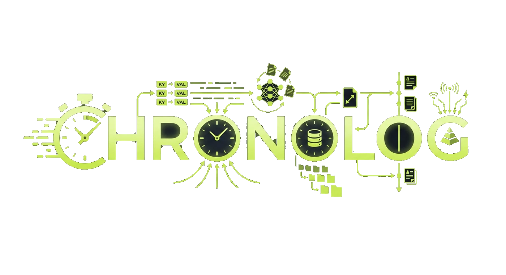
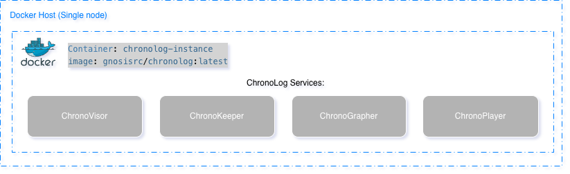
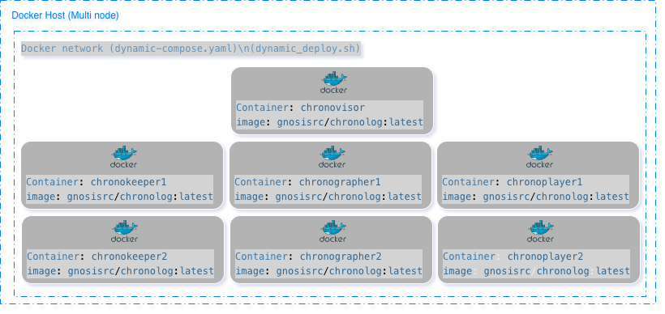

> [!IMPORTANT]
> **ChronoLog MCP is now available.**
> Integrate ChronoLog directly with LLMs through our new MCP server for real-time logging, event processing, and structured interactions.  
> [Code](https://github.com/iowarp/agent-toolkit/tree/main/agent-toolkit-mcp-servers/chronolog) - [Documentation](https://www.iowarp.ai/docs/agent-toolkit/mcp#system-monitoring-2-servers-14-tools)

<p align="center">
  <a href="https://www.chronolog.dev">
    
  </a>
</p>

<h1 align="center">ChronoLog</h1>

<p align="center"><strong>Distributed Shared Tiered Log Store</strong></p>

<p align="center">A distributed and tiered shared log storage ecosystem that uses physical time to distribute log entries while providing total log ordering.</p>

<p align="center">
  <a href="LICENSE"></a>
  <a href="https://github.com/grc-iit/ChronoLog"></a>
  <a href="https://grc.iit.edu/"></a>
  <a href="https://www.chronolog.dev"></a>
  <a href="https://github.com/grc-iit/ChronoLog/issues"></a>
  <a href="https://github.com/grc-iit/ChronoLog/releases/latest"></a>
</p>

<p align="center">
  <strong>Members</strong><br><br>
  <table border="0" cellpadding="0" cellspacing="0" align="center">
    <tr>
      <td align="center" style="padding: 0 10px; border: none;">
        <a href="https://www.iit.edu">
          <br>
          <strong>Illinois Tech</strong>
        </a>
      </td>
      <td align="center" style="padding: 0 10px; border: none;">
        <a href="https://www.uchicago.edu">
          <br>
          <strong>UChicago</strong>
        </a>
      </td>
    </tr>
  </table>
</p>


## Overview

**ChronoLog** is a distributed, tiered shared log storage system that provides scalable log storage with time-based data ordering and total log ordering guarantees. By leveraging physical time for data distribution and utilizing multiple storage tiers for elastic capacity scaling, ChronoLog eliminates the need for a central sequencer while maintaining high performance and scalability.

The system's modular, plugin-based architecture serves as a foundation for building scalable applications, including SQL-like query engines, streaming processors, log-based key-value stores, and machine learning integration modules.

### Key Features

ChronoLog is built on four foundational pillars:

- **Time-Structured Ingestion** — Events are chunked and organized by physical time, enabling high-throughput parallel writes without a central sequencer.

- **Tiered & Efficient Storage** — StoryChunks flow across fast and scalable storage tiers, automatically balancing performance and capacity.

- **Concurrent Access at Scale** — Multi-writer, multi-reader support with zero coordination overhead, optimized for both RDMA and TCP networks.

- **Modular, Extensible Serving Layer** — Plugin-based architecture enables custom services to run directly on the log, supporting diverse application requirements.

### Use Cases

ChronoLog's flexible architecture supports a wide range of applications:

- **AI & LLM Integration** — MCP server for seamless LLM integration with enterprise logging and real-time event processing.

- **Machine Learning & Training** — TensorFlow module for training and inference workflows using time-ordered data streams.

- **SQL-like Query Engine** — Query and analyze log data with SQL semantics and time-based distribution.

- **Streaming Processor** — Real-time event processing and analytics for monitoring, alerting, and data pipelines.

- **Log-based Key-Value Store** — Distributed key-value stores with strong consistency guarantees.

For more information, visit [chronolog.dev](https://www.chronolog.dev).

<!--
## Wiki:
Learn more detailed information about the project on ChronoLog's Wiki: https://github.com/grc-iit/ChronoLog/wiki/

## Main publication

<div style="border: 1px solid #555555; padding: 10px; border-radius: 5px; background-color: #888888;">
  <p style="font-size: 1.2em; margin: 0;">
    A. Kougkas, H. Devarajan, K. Bateman, J. Cernuda, N. Rajesh, X.-H. Sun. 
    <a href="http://www.cs.iit.edu/~scs/testing/scs_website/assets/files/kougkas2020chronolog.pdf" target="_blank">
      <strong>"ChronoLog: A Distributed Shared Tiered Log Store with Time-based Data Ordering"</strong>
    </a>, 
    Proceedings of the 36th International Conference on Massive Storage Systems and Technology (MSST 2020).
  </p>
</div>
-->

## Installation

> [!NOTE]
> **ChronoLog is designed for deployment on distributed clusters and complex environments.**
> For comprehensive installation guides, configuration details, and deployment strategies, please refer to our [detailed documentation on the Wiki](https://github.com/grc-iit/ChronoLog/wiki/).

### 🐳 Docker Installation 

#### Single-Node Deployment


Pull Docker image:

```bash
docker pull gnosisrc/chronolog:latest
```

Run container interactively:

```bash
docker run -it --rm --name chronolog-instance gnosisrc/chronolog:latest
```

Deploy components:

```bash
/home/grc-iit/chronolog_repo/deploy/local_single_user_deploy.sh -d -w /home/grc-iit/chronolog_install/Release
```

Verify deployment:

```bash
pgrep -la chrono
```
**For detailed setup instructions, troubleshooting, and advanced configuration, see:** [Single-node Docker tutorial](https://github.com/grc-iit/ChronoLog/wiki/Tutorial-3:-Running-ChronoLog-with-Docker-(single-node))

#### Multi-Node Deployment



Pull Docker image:

```bash
docker pull gnosisrc/chronolog:latest
```

Download deployment script:

```bash
wget https://raw.githubusercontent.com/grc-iit/ChronoLog/refs/heads/develop/CI/docker/dynamic_deploy.sh
```

```bash
chmod +x dynamic_deploy.sh
```

Run default deployment:

```bash
./dynamic_deploy.sh -n 7 -k 2 -g 2 -p 2
```

Verify containers:

```bash
docker ps
```

**For detailed setup instructions, troubleshooting, and advanced configuration, see:**
[Multi-Node Docker tutorial](https://github.com/grc-iit/ChronoLog/wiki/Tutorial-4:-Running-ChronoLog-with-Docker-(Multi-node))

<!--### 📦 Spack Installation-->

## Documentation

Comprehensive documentation and tutorials are available on our [Wiki](https://github.com/grc-iit/ChronoLog/wiki). The documentation covers everything from getting started to advanced configuration and deployment strategies.

### 📚 Documentation

| Document | Description |
|----------|-------------|
| [Getting Started](https://github.com/grc-iit/ChronoLog/wiki/01.-Getting-Started) | Introduction and first steps with ChronoLog |
| [Installation](https://github.com/grc-iit/ChronoLog/wiki/02.-Installation) | Detailed installation guides and requirements |
| [Configuration](https://github.com/grc-iit/ChronoLog/wiki/03.-Configuration) | Configuration options and settings |
| [Deployment](https://github.com/grc-iit/ChronoLog/wiki/04.-Deployment) | Deployment strategies and best practices |
| [Client API](https://github.com/grc-iit/ChronoLog/wiki/05.-Client-API) | API reference and usage examples |
| [Client Examples](https://github.com/grc-iit/ChronoLog/wiki/06.-Client-Examples) | Code examples and use cases |
| [Architecture](https://github.com/grc-iit/ChronoLog/wiki/07.-Architecture) | System architecture and design principles |
| [Plugins](https://github.com/grc-iit/ChronoLog/wiki/08.-Plugins) | Plugin development and integration |
| [Code Style Guidelines](https://github.com/grc-iit/ChronoLog/wiki/09.-Code-Style-Guidelines) | Coding standards and conventions |
| [Contributors Guidelines](https://github.com/grc-iit/ChronoLog/wiki/10.-Contributors-Guidelines) | Guidelines for contributing to ChronoLog |

### 🎓 Tutorials

| Tutorial | Description |
|----------|-------------|
| [Tutorial 1: First Steps with ChronoLog](https://github.com/grc-iit/ChronoLog/wiki/Tutorial-1:-First-Steps-with-ChronoLog) | Get started with your first ChronoLog deployment |
| [Tutorial 2: How to run a Performance test](https://github.com/grc-iit/ChronoLog/wiki/Tutorial-2:-How-to-run-a-Performance-test) | Learn how to benchmark and test ChronoLog performance |
| [Tutorial 3: Running ChronoLog with Docker (single-node)](https://github.com/grc-iit/ChronoLog/wiki/Tutorial-3:-Running-ChronoLog-with-Docker-(single-node)) | Deploy ChronoLog on a single node using Docker |
| [Tutorial 4: Running ChronoLog with Docker (Multi-Node)](https://github.com/grc-iit/ChronoLog/wiki/Tutorial-4:-Running-ChronoLog-with-Docker-(Multi-node)) | Deploy ChronoLog across multiple nodes using Docker |

## Collaborators

We are grateful for the collaboration and support from our research and industry partners.

<table>
<thead>
<tr>
<th style="width: 35%;">Organization</th>
<th style="width: 65%;">Description</th>
</tr>
</thead>
<tbody>
<tr>
<td> <a href="https://www.anl.gov">Argonne National Laboratory</a></td>
<td>Collaborating with the funcX team to enable event-based and real-time computing capabilities, supporting scalable execution of machine learning workloads and integration with Colmena framework for materials science applications.</td>
</tr>
<tr>
<td> <a href="https://www.uchicago.edu">University of Chicago</a></td>
<td>Working with Tom Glanzman and the Dark Energy Science Collaboration on Parsl workflow extensions for Rubin Observatory data processing, enabling extreme-scale logging and monitoring for cosmology workflows.</td>
</tr>
<tr>
<td> <a href="https://parsl-project.org">Parsl</a></td>
<td>Developing workflow extensions to enable extreme-scale logging and monitoring for large-scale scientific workflows, with potential impact across domains including biology, social science, and high energy physics.</td>
</tr>
<tr>
<td> <a href="https://www.iit.edu/ifsh">Institute for Food Safety and Health (IFSH)</a></td>
<td>Exploring new scientific applications of ChronoLog in genomics and bioinformatics, with discussions helping shape development priorities while informing adjacent research communities about ChronoLog capabilities.</td>
</tr>
<tr>
<td> <a href="https://www.llnl.gov">Lawrence Livermore National Laboratory</a></td>
<td>Working with the system scheduler team to integrate ChronoLog with Sonar and Flux job scheduler, eliminating bottlenecks in HPC resource management and telemetry data collection.</td>
</tr>
<tr>
<td> <a href="https://www.wisc.edu">University of Wisconsin-Madison</a></td>
<td>Working with Shaowen Wang to deploy ChronoLog as a storage backend for CyberGIS, addressing growing data volume and velocity demands while refining ChronoLog features through GIS workloads.</td>
</tr>
<tr>
<td> <a href="https://illinois.edu">University of Illinois at Urbana-Champaign</a></td>
<td>Collaborating on Parsl workflow extensions for the Dark Energy Science Collaboration, enabling extreme-scale logging and monitoring for Rubin Observatory data processing workflows.</td>
</tr>
<tr>
<td> <a href="https://www.depaul.edu">DePaul University</a></td>
<td>Working with Tanu Malik to develop novel lightweight indexing mechanisms within the ChronoKeeper for efficient querying of log data by both identifier and value predicates.</td>
</tr>
<tr>
<td> <a href="https://www.paratools.com">ParaTools, Inc.</a></td>
<td>Exploring integration and evaluation of ChronoLog with performance monitoring tools, optimizing ChronoLog and its native plugins for application performance analysis use cases.</td>
</tr>
<tr>
<td> <a href="https://omnibond.com">OmniBond Systems LLC</a></td>
<td>Working with Boyd Wilson to fine-tune the storage stack using extended attributes in OrangeFS, optimizing ChronoLog's multi-tiered distributed log store performance.</td>
</tr>
</tbody>
</table>

## Resources

- **Documentation**: Visit [chronolog.dev](https://www.chronolog.dev) for comprehensive documentation and guides
- **GitHub Repository**: [github.com/grc-iit/ChronoLog](https://github.com/grc-iit/ChronoLog)
- **Issues & Support**: Report issues or request features on [GitHub Issues](https://github.com/grc-iit/ChronoLog/issues)
- **Releases**: Check out the latest releases on [GitHub Releases](https://github.com/grc-iit/ChronoLog/releases)

<br>

---

<br>

<div align="center">


**Gnosis Research Center**  
Illinois Institute of Technology  
*Advancing the Future of Scalable Computing and Data-Driven Discovery*

**Connect with us:**  
🌐 [Website](https://grc.iit.edu) • 🐦 [X (Twitter)](https://twitter.com/grc_iit) • 💼 [LinkedIn](https://www.linkedin.com/school/gnosis-research-center) • 📺 [YouTube](https://www.youtube.com/@grc_iit) • ✉️ [Email](mailto:grc@illinoistech.edu)
</div>
<br>
<p align="center">
  <strong>Sponsored by:</strong><br>
  <a href="https://www.nsf.gov"></a><br>
  National Science Foundation (NSF CSSI-2104013)
</p>