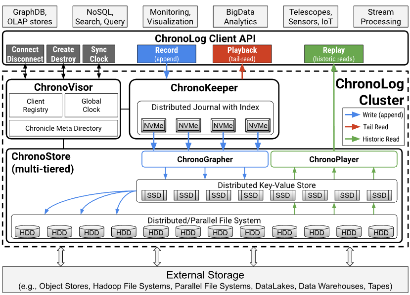
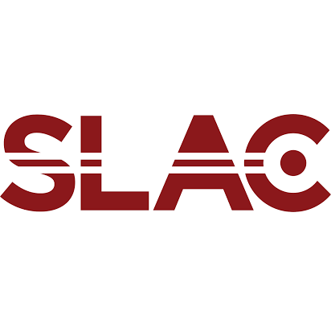
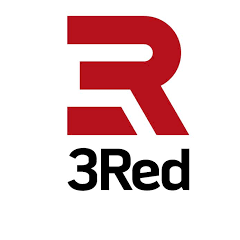

> [!IMPORTANT]
> **ChronoLog MCP is now available.**
> Integrate ChronoLog directly with LLMs through our new MCP server for real-time logging, event processing, and structured interactions.  
> 📖 [Documentation](https://iowarp.github.io/iowarp-mcps/docs/mcps/chronolog/)

  

<h1 align="center">ChronoLog</h1>

<strong>Distributed Shared Tiered Log Store</strong>

A distributed and tiered shared log storage ecosystem that uses physical time to distribute log entries while providing total log ordering.

  
  
  
  
  
  

## Overview

**ChronoLog** is a distributed, tiered shared log storage system that provides scalable log storage with time-based data ordering and total log ordering guarantees. By leveraging physical time for data distribution and utilizing multiple storage tiers for elastic capacity scaling, ChronoLog eliminates the need for a central sequencer while maintaining high performance and scalability.

The system's modular, plugin-based architecture serves as a foundation for building scalable applications, including SQL-like query engines, streaming processors, log-based key-value stores, and machine learning integration modules.

  

### Key Features

ChronoLog is built on four foundational pillars:

- **Time-Structured Ingestion** — Events are chunked and organized by physical time, enabling high-throughput parallel writes without a central sequencer.

- **Tiered & Efficient Storage** — StoryChunks flow across fast and scalable storage tiers, automatically balancing performance and capacity.

- **Concurrent Access at Scale** — Multi-writer, multi-reader support with zero coordination overhead, optimized for both RDMA and TCP networks.

- **Modular, Extensible Serving Layer** — Plugin-based architecture enables custom services to run directly on the log, supporting diverse application requirements.

### Use Cases

ChronoLog's flexible architecture supports a wide range of applications:

- **SQL-like Query Engine** — Query and analyze log data with SQL semantics, leveraging time-based data distribution for efficient processing.

- **Streaming Processor** — Real-time event processing and analytics on time-ordered log streams for monitoring, alerting, and data pipeline applications.

- **Log-based Key-Value Store** — Build distributed key-value stores on ChronoLog's ordered log abstraction with strong consistency guarantees.

- **Machine Learning Integration** — TensorFlow module for training and inference workflows using time-ordered data streams.

- **Enterprise Logging** — Enterprise-grade logging with real-time event processing and structured interaction management via the MCP server.

For more information, visit [chronolog.dev](https://www.chronolog.dev).

## Wiki:
Learn more detailed information about the project on ChronoLog's Wiki: https://github.com/grc-iit/ChronoLog/wiki/

## Main publication

  

    A. Kougkas, H. Devarajan, K. Bateman, J. Cernuda, N. Rajesh, X.-H. Sun. 
    <a href="http://www.cs.iit.edu/~scs/testing/scs_website/assets/files/kougkas2020chronolog.pdf" target="_blank">
      <strong>"ChronoLog: A Distributed Shared Tiered Log Store with Time-based Data Ordering"</strong>
    </a>, 
    Proceedings of the 36th International Conference on Massive Storage Systems and Technology (MSST 2020).
  

## Members

## Collaborators

## Sponsors

National Science Foundation (NSF CSSI-2104013)