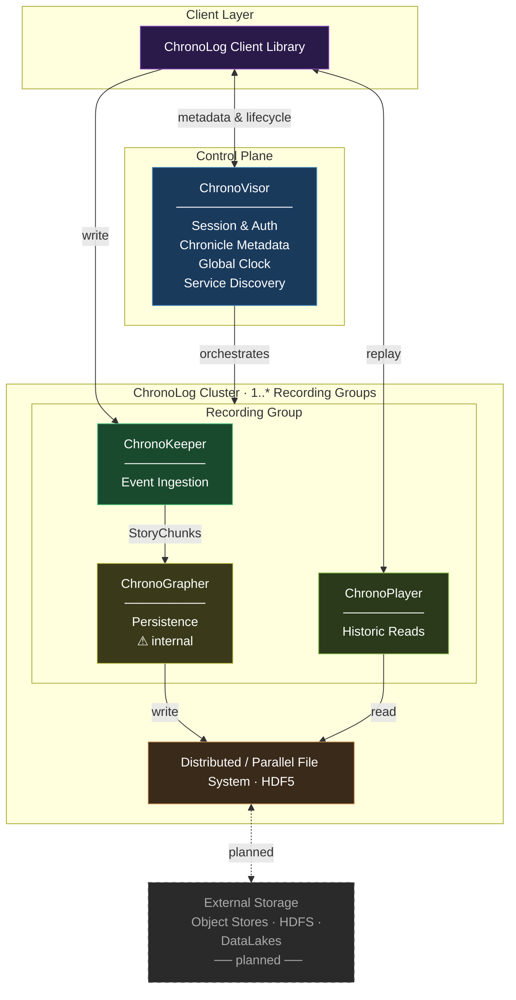

# Core Concepts

:::info
This page is under construction. More detailed content will be added soon.
:::

ChronoLog organizes data using a layered hierarchy of **Chronicles**, **Stories**, and **Events**. Understanding these abstractions is key to working with the system.

## Chronicle

A **Chronicle** is the top-level organizational unit in ChronoLog. It groups related Stories together for easier data management. Think of it as a namespace or a project container.

## Story

A **Story** is a time-series data stream within a Chronicle. It represents a logical sequence of events that share a common context (e.g., a sensor feed, a job trace, or an application log). Stories provide ordering guarantees across their events.

## Event

An **Event** is the smallest data unit in ChronoLog. Each event contains:

- **Timestamp** — physical time assigned at ingestion
- **Client ID** — identifier of the producing client
- **Index** — per-client counter for disambiguation
- **Log Record** — the actual payload (arbitrary string data)

## Storage Tiers

ChronoLog uses a multi-tiered architecture where data flows through three layers:

1. **ChronoKeeper (Tier 1)** — fast ingestion on compute nodes
2. **ChronoGrapher (Tier 2)** — merging and sequencing on storage nodes
3. **Persistent Storage (Tier 3)** — long-term archival (e.g., HDF5)

Data automatically moves from higher tiers to lower tiers over time, optimizing for both write throughput and long-term storage efficiency.

## Components

ChronoLog is composed of four main components, each with a distinct role and typically deployed on a specific node type.

| Icon | Component | Role | Node type |
|:----:|---|---|---|
| 🔭🗂️ | **ChronoVisor** | Orchestrates the system — manages client sessions, chronicle/story metadata, global clock, and service discovery. Single instance per deployment. | Management node |
| ⚡📥 | **ChronoKeeper** | Ingests log events from clients at high throughput, buffers them into StoryChunks, and drains them downstream. Multiple instances per Recording Group. | Compute node |
| 🗄️✍️ | **ChronoGrapher** | Receives partial StoryChunks from Keepers, merges and sequences them into complete time-range chunks, and archives them to persistent storage. One per Recording Group. | Storage node |
| ▶️🔍 | **ChronoPlayer** | Reads archived data from persistent storage and serves historical replay queries back to clients. One per Recording Group. | Storage node |

## System Architecture

ChronoLog is a **disaggregated storage system** built around a strict **control plane / data plane separation**.

### Control Plane

**ChronoVisor** is the sole control plane component. It handles:
- Client sessions and authentication
- Chronicle and Story metadata
- Global clock synchronization
- Service discovery — on `AcquireStory`, it selects an active set of Keepers and a Player, and returns their addresses to the client

ChronoVisor never sits in the data path. Once a Story is acquired, the client communicates directly with the assigned data plane services.

### Data Plane

The data plane is composed of three independently deployable services:

| Service | Role | Client-facing |
|---|---|---|
| **ChronoKeeper** | Receives log events, buffers them into StoryChunks | Yes — direct write RPC |
| **ChronoGrapher** | Drains StoryChunks from Keepers, writes HDF5 files | No — internal only |
| **ChronoPlayer** | Reads HDF5 archives, streams chunks back to clients | Yes — replay RPC |

ChronoGrapher and ChronoPlayer share a **Distributed/Parallel File System** (HDF5 files) as their interface. ChronoGrapher writes; ChronoPlayer monitors and reads. No direct RPC exists between them.

### Recording Groups

A **Recording Group** is the unit of scalability within the cluster. ChronoVisor organizes data plane services into groups, each consisting of:

- **N ChronoKeepers** — share the ingestion load for a Story via round-robin event distribution
- **1 ChronoGrapher** — drains all Keepers in the group and persists to shared storage
- **1 ChronoPlayer** — serves replay requests from that same storage

When a client calls `AcquireStory`, ChronoVisor picks an active Recording Group and assigns the Story to it for its entire lifetime. All events for that Story flow through the Keepers of that group; all replays are served by its Player. This keeps data locality within the group and allows the cluster to scale by adding more groups.

### Client Library

The ChronoLog client library is the unified integration point. It abstracts the internal topology: service discovery via ChronoVisor, direct event writing to Keepers, and async replay from ChronoPlayer. Application developers interact with a single API without needing to know the cluster layout.

